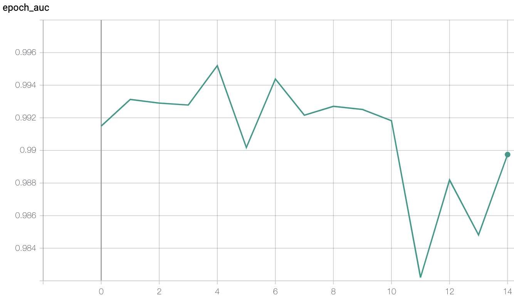

# Classification Of Pneumonia In Chest X-Rays
This computer vision project is designed to utilize Convultional Neural Networks to detect pneumonia based on chest X-rays.

# Motivating Facts
- Each year Pneumonia affects ~450 million people & is in the top 5 leading causes of death each year [1]
- Over 2 Billion chest X-rays/yr are performed, over half of which lack access to radiological diagnostics [2]
- Chest X-rays are the best way to detect Pneumonia [3]

__Conclusion: Automated detection of pneumonia at the level of radiological experts would:__
- _Decrease_ the **time** it takes to get feedback on a medical diagnosis
- _Increase_ the **quantity** of patients diagnosed accurately
- _Increase_ the **quality** of care to patients

## Project Goals

The goal was to develop a pipeline to detect Pneumonia with a high degree of accuracy as a starting point to then detect COVID-19.

### Project Replication

To replicate the project download the data[4] and follow the attached IPYNB

## Data & EDA

The data[4] comes from pediatric patients aged 1-5 from Guangzhou Women & Children's Medical Center, Guangzhou. All chest radiographs were initially screened for quality control by removing all low quality or unreadable scans. The diagnoses for the images were then graded by 2 expert physicians and the evaluation set was also checked by a 3rd expert

There are 5,863 X-ray images, 3 folders (train, test, val) and 2 categories (Pneumonia/Normal).

"
 Figure S6. Illustrative Examples of Chest X-Rays in Patients with Pneumonia, Related to Figure 6
The normal chest X-ray (left panel) depicts clear lungs without any areas of abnormal opacification in the image. Bacterial pneumonia (middle) typically exhibits a focal lobar consolidation, in this case in the right upper lobe (white arrows), whereas viral pneumonia (right) manifests with a more diffuse ‘‘interstitial’’ pattern in both lungs.
http://www.cell.com/cell/fulltext/S0092-8674(18)30154-5 "

## Convolutional Neural Network Modeling

27 unique Convolutional Neural Networks were compiled and trained on the dataset for 15 epochs each. The 27 was chosen as a grid search between 3 variations of 3 parameters (3x3x3 different networks). These parameters and options are as follows:
- 0,1, or 2 Dense Layers
- 1,2, or 3 Convolutions
- 32, 64, or 128 nodes.

Each of these would intake X-ray images, reduce them to size 128 x 128 pixels (1/8th the original image size) and output a prediction of whether the X-ray revealed Pneumonia or was Normal.
  
## Conclusion

Out of the CNN's that were trained, the overall best model reached the highest recall, best accuracy, lowest loss, and highest recall at the 15th epoch suggesting that in order to avoid overfitting the best training thus far discovered would be using 3 Convulational layers, 32 nodes, 2 dense layers, and trained for 15 epochs.

Recall is one of the most important metrics to focus on as this is a medical decision and could mean the difference between life and death and therefore is much more important to flag those X-rays which test positive for pneumonia than to miss them. 

After only 1 epoch a recall of .83 was achieved. The recall would oscillate within the range of .83 and .99 for the remaining 15 epochs.

## Coronavirus Edition - *GET INVOLVED!*

I am currently working with the company Arterys through UCLA's COVID-19 startup accelerator program to develop an open source tool that will identify the SARS-CoV-2 virus in chest X-rays & CT-Scans. This project serves as a base where the next step is to semantically segment the outer lining and lower lobes of the lungs. This tool aims to streamline the diagnostics for overwhelmed and understaffed communities throughout the world.

Find Out More & Get Involved:
https://helpwithcovid.com/projects/253-accelerate-covid-19-medical-image-ai-model-research-and-development

*The diagnosis of COVID-19 which presents as __Bilateral Interstitial Pneumonia__ through chest X-rays & CT-Scans has been performed in China, Italy, and the US [5]*

[1]: https://www.thelancet.com/journals/lancet/article/PIIS0140-6736(10)61459-6/fulltext
[2]: https://arxiv.org/pdf/1711.05225.pdf
[3]: https://www.nhlbi.nih.gov/health-topics/chest-x-ray
[4]: https://data.mendeley.com/datasets/rscbjbr9sj/2
[5]: https://jamanetwork.com/journals/jama/fullarticle/2762130
